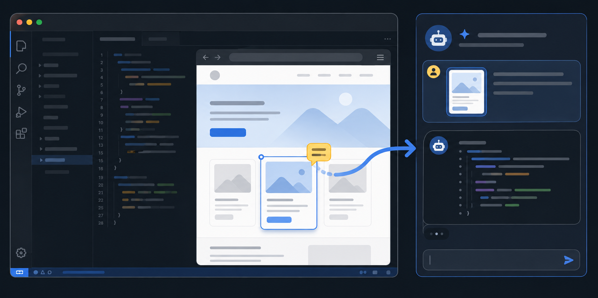

# Claude Code Browser Annotator

Browser Annotator lets you open a live webpage inside VS Code, point at what you want changed, and send the relevant page context to Claude Code.

## What you can do

- **Comment on an element** — select a button, heading, card, image, or other page element and explain the change you want.
- **Capture an area** — draw a rectangle around part of the page and attach it with a comment.
- **Draw on the page** — mark several places with the pencil, then explain the requested change.
- **Capture the viewport** — send an image of everything currently visible in the browser.

## Before you start

You need:

1. VS Code 1.96 or later.
2. The official Anthropic Claude Code extension, open in the **same VS Code window**.
3. Chrome, Chromium, Edge, or Brave.
4. A website or local development server to open.

## Run from source

1. Run `npm install`.
2. Open this folder in VS Code.
3. Press `F5` and choose **Run Extension**.
4. In the Extension Development Host, run **Browser: Claude Code Browser Annotator** from the Command Palette.

## Use

1. Interact with the page normally.
2. Select the comment button, screenshot-area button, or pencil button.
3. Select or mark the relevant UI and enter your comment.
4. Press Enter or select **+**. The extension adds generated context files to the current Claude Code composer using `@` mentions and pastes your comment for review. You remain in control of submitting it.

Generated captures are stored temporarily under `.claude-browser-captures` in the open workspace so Claude Code can resolve them. The session directory is removed when its browser panel closes.

## Notes

- The integration uses Claude Code's supported `claude-vscode.insertAtMention` and `claude-vscode.focus` commands.
- Browser context goes to Claude Code in the same VS Code window; it is never submitted automatically.
- In Remote SSH, WSL, Dev Containers, and Codespaces, Chrome or Chromium must be installed in the remote environment.
- If Claude Code is unavailable, the context is copied to the clipboard instead.

Run `npm test` for the helper, capture, and browser interaction regression suite.
